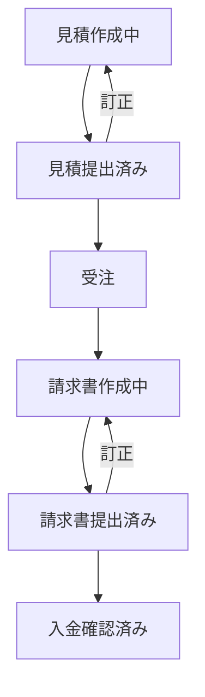

# ステータス

- 見積作成中
- 見積提出済み
- 受注
- 請求書作成中
- 請求書提出済み
- 入金確認済み

# バージョン管理

見積と請求書は、バージョン管理を行う。
提出済みステータスから、訂正を行う場合は、新しいバージョンを作成する。
旧バージョンも参照できるようにする。

# ワークフロー

# 見積ID

DBのIDはuuidで持つが、それとは別に採番する。
６桁の大文字英数字。ユーザーグループ内で重複不可。自動採番。
例：AK23B1

# 管理番号

見積と請求書は、管理番号を付与する。
管理番号は、自動的に生成される。
管理番号は、バージョン管理を行う。  
フォーマット：[INV or EST]-[INVOICE_ID]-[VERSION]
例：INV-AK23B1-01
例：EST-AK23B1-01
